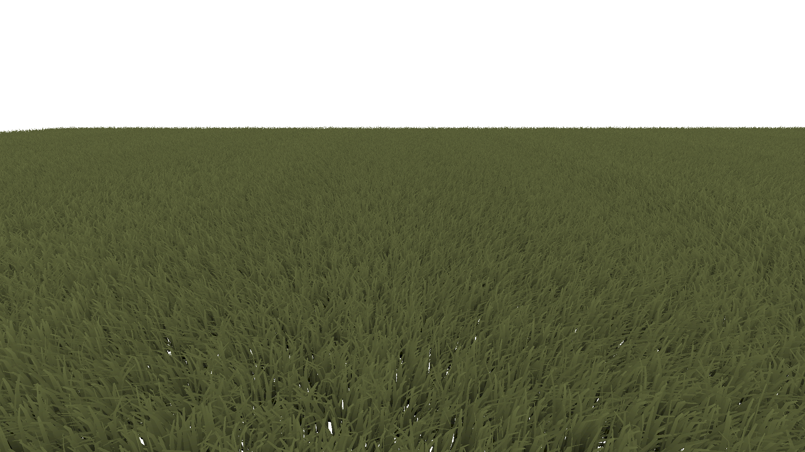
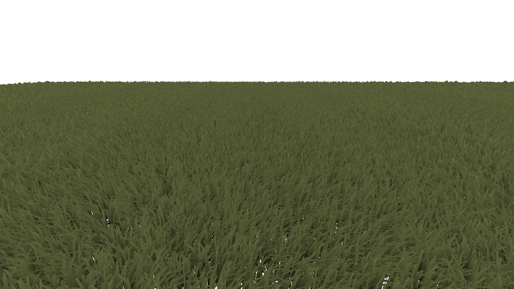

# Vulkan-MeshShader-Grass
Implementation of a grass rendering  using Vulkan Mesh Shaders.  
From Procedural grass rendering
https://gpuopen.com/learn/mesh_shaders/mesh_shaders-procedural_grass_rendering/

No Level of Detail

Level of Detail

